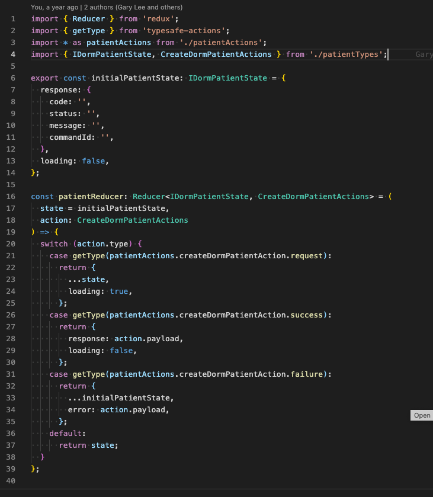

# Redux Toolkit :rocket:

## What It is

It is Redux's <b>official, opinionated</b> toolset for <i>effcient</I> Redux development. The creators of Redux intend for Redux toolkit to be used as the "standard way to write Redux logic".

[Click to go to the RTK Docs](https://redux-toolkit.js.org/introduction/getting-started)

## Problem Statement

### :dart: "Writing out each type, action creator and reducer <i>by hand</i> is tedious"

- Consider the samples of type, action and reducer below:
- Action:
  `export enum DormPatientActionTypes { CREATE_DORM_PATIENT = '@@patient/CREATE_DORM_PATIENT_REQUEST', CREATE_DORM_PATIENT_SUCCESS = '@@patient/CREATE_DORM_PATIENT_SUCCESS', CREATE_DORM_PATIENT_FAILURE = '@@patient/CREATE_DORM_PATIENT_FAILURE', }`

      `export  const  createDormPatientAction = createAsyncAction(
      DormPatientActionTypes.CREATE_DORM_PATIENT,
      DormPatientActionTypes.CREATE_DORM_PATIENT_SUCCESS,
      DormPatientActionTypes.CREATE_DORM_PATIENT_FAILURE
      )<ICreateDormPatient, ResponseMessage, ResponseMessage | undefined>();`

- Type: Types of ICreateDormPatient, ResponseMessage were defined in a separate patientTypes.ts file

- Reducer:
  

- Action types require me to refer to a types defined in a previous file. In my reducer, I need to reference the actions defined in the action file.
- The result: <b>A lot of referring to different files. Can become tedious when you have many action creators, types and reducers</b>

### How does Redux Toolkit (RTK) reduce hand-written code? :pencil2:

- Introducing createSlice() :pizza:

- What it is: An API that bakes actions into the reducer :cake:
- Consider the example below:

- createSlice takes in an object with 3 main options:
  - name (of Slice)
  - initialState (of reducer)
  - reducers

#### Cool Things about createSlice

1. **`createSlice` will automatically generate action creators** that correspond to each case reducer function we provide

2. `createSlice` uses a library called [Immer](https://immerjs.github.io/immer/) inside.**Immer tracks all the changes you've tried to make, and then uses that list of changes to return a safely immutably updated value**, as if you'd written all the immutable update logic by hand.

- In the past, we had to do this to avoid manipulating the reducer state directly:
  - `return { ...state, value: 123}`
- Now we can simply do this:
  - `getAllDomainsSuccess(state: IDomain, action: PayloadAction<any>) { state.loading = false; state.domains = action.payload;},`
